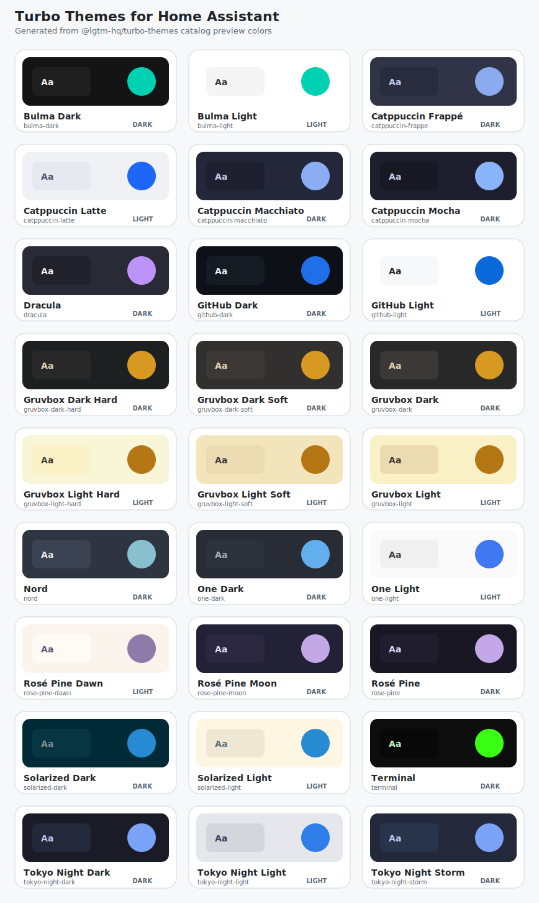

# hass-turbo-themes

Home Assistant themes generated from
[`@lgtm-hq/turbo-themes`](https://www.npmjs.com/package/@lgtm-hq/turbo-themes).
This repository packages the Turbo Themes palette as a HACS-installable theme
repository for Home Assistant.

> This repository is intended for HACS custom-repository installation until a
> default-store submission lands. It is not advertised as available in the HACS
> default store yet.

## Preview

These are static swatches generated from the `catalog.json` preview colors. They
are not live Home Assistant screenshots.



## Install with HACS

1. Open Home Assistant.
2. Go to **HACS** -> **Integrations** -> menu -> **Custom repositories**.
3. Add this repository URL:
   `https://github.com/lgtm-hq/hass-turbo-themes`
4. Choose **Theme** as the category.
5. Install **hass-turbo-themes** from HACS.
6. Restart Home Assistant or reload themes from **Developer Tools** -> **YAML**.
7. Select a theme from your user profile.

## Manual install

1. Download the latest release or source archive from this repository.
2. Copy the theme YAML file or directory into your Home Assistant themes folder:
   `/config/themes/`
3. Make sure `configuration.yaml` includes themes:

   ```yaml
   frontend:
     themes: !include_dir_merge_named themes
   ```

4. Restart Home Assistant or reload themes from **Developer Tools** -> **YAML**.
5. Pick the theme from your Home Assistant profile.

## Theme list

The package currently provides **27 flat themes** plus **8 auto themes**.

Flat themes are explicit light or dark entries:

| Theme | ID | Appearance |
| --- | --- | --- |
| `Bulma Dark` | `bulma-dark` | dark |
| `Bulma Light` | `bulma-light` | light |
| `Catppuccin Frappé` | `catppuccin-frappe` | dark |
| `Catppuccin Latte` | `catppuccin-latte` | light |
| `Catppuccin Macchiato` | `catppuccin-macchiato` | dark |
| `Catppuccin Mocha` | `catppuccin-mocha` | dark |
| `Dracula` | `dracula` | dark |
| `GitHub Dark` | `github-dark` | dark |
| `GitHub Light` | `github-light` | light |
| `Gruvbox Dark Hard` | `gruvbox-dark-hard` | dark |
| `Gruvbox Dark Soft` | `gruvbox-dark-soft` | dark |
| `Gruvbox Dark` | `gruvbox-dark` | dark |
| `Gruvbox Light Hard` | `gruvbox-light-hard` | light |
| `Gruvbox Light Soft` | `gruvbox-light-soft` | light |
| `Gruvbox Light` | `gruvbox-light` | light |
| `Nord` | `nord` | dark |
| `One Dark` | `one-dark` | dark |
| `One Light` | `one-light` | light |
| `Rosé Pine Dawn` | `rose-pine-dawn` | light |
| `Rosé Pine Moon` | `rose-pine-moon` | dark |
| `Rosé Pine` | `rose-pine` | dark |
| `Solarized Dark` | `solarized-dark` | dark |
| `Solarized Light` | `solarized-light` | light |
| `Terminal` | `terminal` | dark |
| `Tokyo Night Dark` | `tokyo-night-dark` | dark |
| `Tokyo Night Light` | `tokyo-night-light` | light |
| `Tokyo Night Storm` | `tokyo-night-storm` | dark |

Auto themes use Home Assistant `modes:` entries. Select one auto theme and Home
Assistant applies its light or dark palette when the frontend switches mode.

| Auto theme | Light mode | Dark mode |
| --- | --- | --- |
| `Bulma` | `Bulma Light` | `Bulma Dark` |
| `Catppuccin` | `Catppuccin Latte` | `Catppuccin Mocha` |
| `GitHub` | `GitHub Light` | `GitHub Dark` |
| `Gruvbox` | `Gruvbox Light` | `Gruvbox Dark` |
| `One` | `One Light` | `One Dark` |
| `Rosé Pine` | `Rosé Pine Dawn` | `Rosé Pine` |
| `Solarized` | `Solarized Light` | `Solarized Dark` |
| `Tokyo Night` | `Tokyo Night Light` | `Tokyo Night Dark` |

## Picking themes in Home Assistant

Each Home Assistant user can choose their own theme:

1. Open the user profile menu in the lower-left corner.
2. Select a theme under **Theme**.
3. Choose an auto theme if you want Home Assistant dark mode to control the
   light/dark variant.

You can also switch themes with an automation. This example uses explicit day
and night themes:

```yaml
automation:
  - alias: Use Turbo Themes by sun state
    mode: single
    trigger:
      - platform: sun
        event: sunrise
      - platform: sun
        event: sunset
    action:
      - service: frontend.set_theme
        data:
          name: >-
            
              Solarized Light
            
              Solarized Dark
            
```

To set a theme globally from Developer Tools -> Services, call
`frontend.set_theme` with the same `name` value you see in the profile picker.

## Collision caveat

Theme names are intentionally plain user-facing names such as `Catppuccin Mocha`
and `Gruvbox Dark`. If you install another Home Assistant theme repository that
defines the same names, Home Assistant can only keep one definition. This is most
likely with vendor-maintained community themes, for example
`catppuccin/home-assistant`.

If a theme looks wrong or does not change after installation, uninstall one of
the colliding theme repositories, reload themes, and select the theme again.
